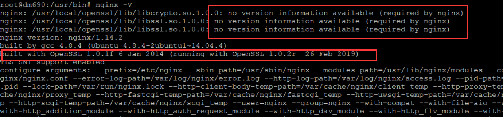

> 最近在对我的blog做SEO,其中使用了 chinaz.com的站长工具，对自己的https做了一下评估，一开始评估下来只有2分。后来按最佳实践配置后，可以达到9分。

#### ChinaZ 上测试SSL/TLS 配置是否最佳的链接：
点击下面的 [ ChinaZ 上测试SSL/TLS 配置是否最佳的链接：](http://s.tool.chinaz.com/https?url=www.m690.com)

#### 第一次只得2分：
* 用了ubuntu 14.04的系统，上面的openssl是1.0.1版本的，有漏洞
解决方案是升级openssl,具体操作如下：
<pre bash>
####下载并解压
wget https://www.openssl.org/source/openssl-1.0.2-latest.tar.gz
tar -zxvf openssl-1.0.2-latest.tar.gz
cd openssl-1.0.2*/
#### 这里有个小技巧，在编译openssl时，生成它的动态链接库，这样就不用再去重新静态编译nginx，用系统自带的gninx，就可以动态的链接这个新的openssl动态链接库，
### -fPIC，在 Linux 下动态链接库，“标准” 的做法是编译成位置无关代码（Position Independent Code，PIC），然后链接成一个动态链接库，不加经常也能正常运行，只是创建 .so 的时候会有一个警告。
### shared 是否生成动态连接库，使用了share,会在lib目录下生成三个.so文件
### --prefix=/usr/local/openssl 把新的openssl安装到哪里
./config -fPIC --prefix=/usr/local/openssl shared no-ssl2 no-ssl3
make && make install

#### 做新的openssl的动态链接
###链接新的openssl命令
mv /usr/bin/openssl /usr/bin/openssl.old
ln -s /usr/local/openssl/bin/openssl 
###链接动态链接库
echo "/usr/local/openssl/lib" > /etc/ld.so.conf.d/openssl.conf
ldconfig -v

#### 完成安装后，重新启动nginx
service nginx restart
</pre>

在用nginx -V命令查看，可以看到如下显示 ：

* 有一个no version infomation available的warning, 但不影响使用
* running openssl 已经是新装的 OpenSSL 1.0.2r版本了。

再次访问  [ ChinaZ 上测试SSL/TLS 配置是否最佳的链接：](http://s.tool.chinaz.com/https)，显示“没有优先使用FS系列加密套件，降级为6”  得到了6分。

#### 继续优化nginx 的SSL配置
继续google "没有优先使用FS系列加密套件，降级为6", 查到了[这篇文章](https://www.jianshu.com/p/89652d3118b6),提示去 <https://cipherli.st/> 做优化

优化nginx 的SSL配置如下：
<pre>
        listen 443;
        ssl on;
        ssl_certificate /etc/nginx/conf.d/ssl/www.m690.com.pem;
        ssl_certificate_key /etc/nginx/conf.d/ssl/www.m690.com.key;
        ssl_protocols TLSv1.3;# Requires nginx >= 1.13.0 else use TLSv1.2
        ssl_prefer_server_ciphers on; 
        #ssl_dhparam /etc/nginx/dhparam.pem; # openssl dhparam -out /etc/nginx/dhparam.pem 4096
        ssl_ciphers ECDHE-RSA-AES256-GCM-SHA512:DHE-RSA-AES256-GCM-SHA512:ECDHE-RSA-AES256-GCM-SHA384:DHE-RSA-AES256-GCM-SHA384:ECDHE-RSA-AES256-SHA384;
        ssl_ecdh_curve secp384r1; # Requires nginx >= 1.1.0
        ssl_session_timeout  10m;
        ssl_session_cache shared:SSL:10m;
        ssl_session_tickets off; # Requires nginx >= 1.5.9
        ssl_stapling on; # Requires nginx >= 1.3.7
        ssl_stapling_verify on; # Requires nginx => 1.3.7
        #resolver $DNS-IP-1 $DNS-IP-2 valid=300s;
        #resolver_timeout 5s; 
###其中 ssl_dhparam/ resolver 被我去掉了。
</pre>
再次访问 <http://s.tool.chinaz.com/https> 测试，已经有9分了。满足。

